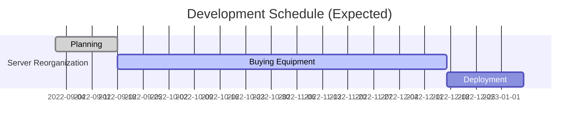

### 📝 Activity
|Live Status (Discord)|GIthub Stats|
|-----|-----|
|||

### ⚡ Language and Frameworks
</a>&nbsp;</a>&nbsp;</a>&nbsp;</a>&nbsp;</a>&nbsp;</a>&nbsp;</a>&nbsp;</a>&nbsp;</a>&nbsp;</a>&nbsp;

### 🌱 Server Status
|Mainframe|NAS|
|-----|-----|
|||

<!--
### Schedules 🛠︎

-->

### 🔑 PGP Key

  
See Below

  
  ### Key Info
    pub   rsa4096 2022-11-01 [SC]
      FE4A0D75DECFDA9A302FCA725B30DAC88CB6890D
    uid           [ultimate] SeongUk Moon (ANTEGRAL) <antegral@antegral.net>
    sig 3        5B30DAC88CB6890D 2022-11-01  SeongUk Moon (ANTEGRAL) <antegral@antegral.net>
    sub   rsa4096 2022-11-01 [E]
    sig          5B30DAC88CB6890D 2022-11-01  SeongUk Moon (ANTEGRAL) <antegral@antegral.net>
    
   ### Key Block
    -----BEGIN PGP PUBLIC KEY BLOCK-----

    mQINBGNghIkBEACvjoi9S+Otoium6BXv0mWT0sfEpaJqPLveKL5Gab5V0gyOncRp
    yFJcGq+HMyJWmwDn3LhO3yEdIgxV38Az2fv3mXC/a5gRGihL1GGS9OSDTVzlRT/Q
    EFMKDCFwE3FVeRXj845CAnYr0+RgsA8PrKmgXXZcsFhHzRSS/MPL6yVAf5RhUFbh
    cA3DTuOGDP6HSBWW82ULV56kFQ52T5Q5PD118+/qnI0L4aaIsj9+SdgPOaO3lOtQ
    XbGBN5u0ytCMO2SApc6z+0I+ZiK2INOIS7UzYDG4d5pH2pxgln1/XuT3rX9TgNhc
    3FG+NTr+249pwPqQM3sw+F+w4LXRADL/VSEUi3G7CG7Gs1e4lYgiw5yFs2Xxs2gC
    gKUeoIHWD28QFbp2bwK8GrO6gYVuvKF6W/+W9Wj1EtVBxIyaw6zblx/KlUbpZmLK
    oR30hj61Pw9yfKpFLM3ubn68wOPl2slIJxIwCf6aDbTF9QUF6UdJmk6w0/tLr4/T
    S44OQPOTF2PCLH7hmR8va82HakKuRuLrZUVdxt1afDm91LUKHyltThNZ3f7ibXcF
    09HpHeP/m2BN49I40UQ81iCcTnlDC4tpxFs5IB5rkw9Dq0K5G4z+U0wxmnymkRrW
    gPLO++GH7LilYCcNwuVBmPzeKWyFFkDfVMH461ra3JygjhjVK8OU8PzUeQARAQAB
    tC9TZW9uZ1VrIE1vb24gKEFOVEVHUkFMKSA8YW50ZWdyYWxAYW50ZWdyYWwubmV0
    PokCTgQTAQgAOBYhBP5KDXXez9qaMC/Kclsw2siMtokNBQJjYISJAhsDBQsJCAcC
    BhUKCQgLAgQWAgMBAh4BAheAAAoJEFsw2siMtokN0hgQAJ227JkGLmvQBNJ/z3rV
    +s/hHlrF/XPqF1UyOYTIhSsWS/Sqvwc8G2RyEIf44K6J8ebjpCxBr0f7MVh7asYR
    zwaV4yYv/7nEu9sGLUkB4G9tRnJ+B6GoyWBz6zAIO4/cRDHTSGQI/B5nLG88hLZT
    Azlp87GrSWE283x38Qp//vtpm71LH7u2DKsBvH8WVka4Px+uHb7tkHgJB8mW1jMO
    njtR7ji1NoJO81CjIhr1YCbbl4kPGDXBf1Y9F8v7rvX+3s4xYuPbswkF/DkLRkpz
    MNhmR7glf4AMke8HSERhAPNZmRlOOgFoeQjG06Q9MsI1PIm5IrYpkHMABQQka7or
    Xcn3B64jKOejoA0x5LOfMRxRDxQizNq5LXxHdR5ODO7mNoSTYdnDOxUyqMhpZGQn
    HXwFZ1zhAeUb8j3Cy55Rxj6GP8oq/pKu3nSSNVp2sDCG4S/v5mBeUmCspz6AqR89
    XYHN7LyrHNWDQK+s0jeoz6ZCVeaJscjNNP+N2oZ4oxV+kV1knW5A2IN8Xhjo2EQC
    LxN/HgHy7ryEhey3P6hIgDk/7TNeiGOYIwCKd7TpLNJs7BUGo7bYuRIZFDhl21RD
    eqnWMJxHafiFxQ665x3vgv5A0zIR0LGXk10B0rK93Tlz+lFUP4zPgdUFHHRNdXyQ
    oDu4R00OmqVZQB+etCRaSBT1uQINBGNghIkBEADhhnD/bBFLJ5NkzYVDBgOossdW
    3l9qAGw2F31wolc7kd9JaQlRudzN1sDJInegNOaNd/6hSjSb4+33r47zP9lIBVlQ
    LWD2eKM//odQDwtkH1iR195WsFNh7ST0LTR9Z15ehD8/kE7zC3QFhlTTgmsb7qH9
    aPWqOzrBFWfBS9b0/UhSYB2skCa+NeCC5TkSMMlv3v8jJO+QSpCGUgDyEqNbehoK
    JX/YGI5IGsE81apA1JG+OQmEHak4IHl1VCODz8IyBmSlv1cOnkojdKevdaDRn0De
    wIr0/ShfzSE/47lz8QIMnI5IJ/Gry74Ute8KSds0YxBdabmD2Bwsd0YD4ud5raL2
    01JXDI2yM9ZZ4obdl8cS1GgJCSa5jHfYG3p1EeXcjUEzx2PUOO/u9/P0EATSaM0b
    tTHenE3qShRjQZfbZCJOZpkyEPIK9jXIxxVYA/CN132CRqsaMOeYnc6Aj2ottz5W
    +VDTH2SGrc6y0esKbaCG72lvUqjFdVdoHpj8VsX8HJH8xkWiHYA5dzhYGM0Q269T
    DUvViRQ2zBGynb0za9UedSIierUqCgQJsZwCnlCkClbDY+EMDJYpOKtZSw3IscnK
    t5ids6S/7U8CUA0mFblGxL6oCkOKVFpQI63ngxsosaPPbVgntLqkXWAGKcAg7rxk
    nXuvEyKdRytxo4Qy0QARAQABiQI2BBgBCAAgFiEE/koNdd7P2powL8pyWzDayIy2
    iQ0FAmNghIkCGwwACgkQWzDayIy2iQ2B9Q/+NQM1+TNVrojaRWrjIR9KHVoB6Znp
    7LMZzcoUmNf7pvK56UufIkAqCcPzZU1zN97NosodMXcKzgGOnLKijuMaDbXFuBoF
    x1Q9FiYFOp+c+cq4d+RG89+liC3lBWb3PMXaX0Wo6Dt2Xa4Uns2fltGM9MVwfU8S
    FdlBqvrvPJUtTMSCt7bTlbIly5Ur4H4vuA8l1tjKy7HMlrO7vgUyj1a3BYnwcgRv
    EiftRx+PjPzJfjw9FJwsZF/NdxyjVHyY4Rgc5/5Y0HJyiCnoLRBWqjo9jpkv9yac
    hgBzmirKCcWwJHxo4nGBcdzfRuLKJPUAt6OxWzth8zaMDhqOMWZJsVVOatE7hbrE
    xkn7+QfXuVWHEfdcFHszS4wWkXoJrBNr/RXpk9Z6j86ovSUhiMvPcFH/e7XrTXrL
    kDXv+q10rXICZwzTHB8A8S19JEsrgBmHlIY5WL0KVyj19LefFBg0W7k6MtQqPe8I
    S79XmSMWraN+xiYqR+kqAl5fOgviem44Qp2I0yrpC3efuVVk+X7t656J1uJAujEp
    GDLjsBjJ/L9vgsnPhWjY44iFxqTAEIL6qsEm86kDFLxEiRiYJU3WaZldwDMPadUF
    xQZJVq1RqJSdA5gCpc611AF4uGBog2bZqXvzs0D4SdrB3M/0CMrekJOC2Fp+TzEE
    Co/ZMiqbEjA/Kww=
    =YH8a
    -----END PGP PUBLIC KEY BLOCK-----

